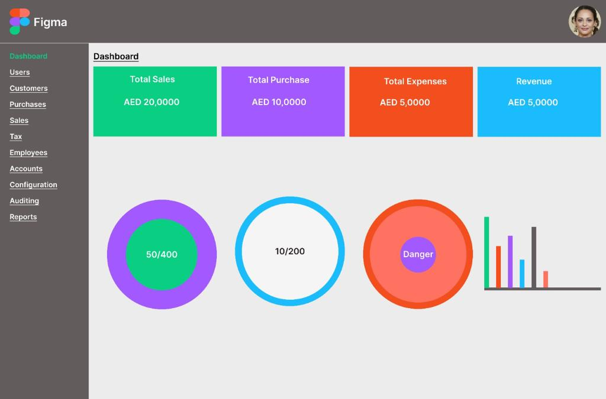

# betasquirrel-task
Assignments from  betasquirrel

## DEMO
- [LINK](https://ijaspp.github.io/betasquirrel-task/)
## Profile Links
- [Github](https://github.com/IJASPP)
- [Linkedin](https://www.linkedin.com/in/muhammed-ijas-pp-6a6714194/)
- [Stackoverflow](https://stackoverflow.com/users/21194325/muhammed-ijas-pp)

## TASKS

| Requirments                 | Output                       |
|-----------------------------|------------------------------|
|||
|||
|||
## TASK 3
- [HTML Basic](https://www.w3schools.com/html/html_basic.asp)
- [HTML Elements](https://www.w3schools.com/html/html_elements.asp)
- [HTML Attributes](https://www.w3schools.com/html/html_attributes.asp)
- [HTML Headings](https://www.w3schools.com/html/html_headings.asp)
- [HTML Paragraphs](https://www.w3schools.com/html/html_paragraphs.asp)
- [HTML Styles](https://www.w3schools.com/html/html_styles.asp)
- [HTML Text Formatting](https://www.w3schools.com/html/html_formatting.asp)
- [HTML Comments](https://www.w3schools.com/html/html_comments.asp)
- [HTML colors](https://www.w3schools.com/html/html_comments.asp)
- [HTML Links](https://www.w3schools.com/html/html_comments.asp)
- [HTML Images](https://www.w3schools.com/html/html_images.asp)

## Linux Commands
- `cd` - change a current directory. Ex: `cd Desktop`,`cd.. `
- `ls` - List contents of directory Ex: `ls -a `
- `pwd` - Display current working directory Ex: `pwd`
- `cat` -Dispaly contents of a file Ex: `cat README.md`
## Git Commands
1. `git config` - configure git user Ex: `git config --global user.name "username"`
2. `git clone` - clone a remote git repo to your local Ex: `git clone https://github.com/IJASPP/betasquirrel-task.git`
3. `git add` - Add your files changes to git Ex:` git add .`
4. `git commit` - commit changes to git Ex:` git commit -m "internal commit"`
5. `git push` - push your local commit to remote repo Ex:`git push origin main`
6. `git reset --hard` - used to undo local changes to the state of a Git repo  
7. `git config --list` - to see the config added
8. `git reset --hard` - remove all changes
9. `git status` - to see the current changes as list
10. `git diff` - see the changes on each file
11. `git log` - see commit history
12. `git stash` - stash your uncommitted changes
## TASK 5
- [HTML Favicon](https://www.w3schools.com/html/html_favicon.asp)
- [HTML Tables](https://www.w3schools.com/html/html_tables.asp)
- [HTML Table Borders](https://www.w3schools.com/html/html_table_borders.asp)
- [HTML Table Sizes](https://www.w3schools.com/html/html_table_sizes.asp)
- [HTML Table Headers](https://www.w3schools.com/html/html_table_headers.asp)
- [HTML Table Padding & Spacing](https://www.w3schools.com/html/html_table_padding_spacing.asp)
- [HTML Table Colspan & Rowspan](https://www.w3schools.com/html/html_table_colspan_rowspan.asp)
- [HTML Table Styling](https://www.w3schools.com/html/html_table_styling.asp)
- [HTML Table Colgroup](https://www.w3schools.com/html/html_table_colgroup.asp)

[def]: images/output-2.png